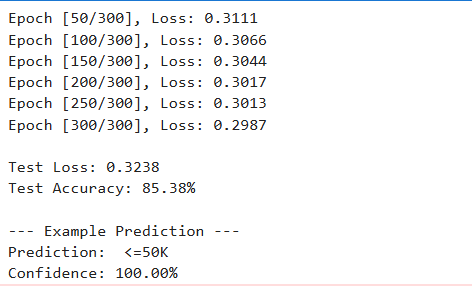

# Binary-Classification with Census Income Dataset 


## Overview

This project implements a tabular deep learning model that processes census data with categorical and continuous features. The model uses embedding layers for categorical variables  and batch normalization for continuous variables to predict income levels.

## code

``` python
import pandas as pd
import numpy as np
import torch
import torch.nn as nn
from torch.utils.data import Dataset, DataLoader
from sklearn.preprocessing import LabelEncoder
from sklearn.model_selection import train_test_split

# Set random seed
torch.manual_seed(42)
np.random.seed(42)

# 1. DATA PREPARATION
df = pd.read_csv('income.csv')

# Define column types (matching your dataset)
cat_cols = ['Workclass', 'Education', 'Marital Status', 'Occupation', 
            'Relationship', 'Race', 'Gender', 'Native Country']
cont_cols = ['Age', 'Final Weight', 'EducationNum', 'Capital Gain', 
             'capital loss', 'Hours per Week']
label_col = 'Income'

# Encode categorical variables
cat_encoders = {}
for col in cat_cols:
    le = LabelEncoder()
    df[col] = le.fit_transform(df[col].astype(str))
    cat_encoders[col] = le

# Encode labels
label_encoder = LabelEncoder()
df[label_col] = label_encoder.fit_transform(df[label_col])

# Create arrays
cats = df[cat_cols].values
conts = df[cont_cols].values.astype(np.float32)
labels = df[label_col].values

# Normalize continuous features
conts = (conts - conts.mean(axis=0)) / conts.std(axis=0)

# Split data (25,000 train, 5,000 test)
cat_train, cat_test = cats[:25000], cats[25000:30000]
cont_train, cont_test = conts[:25000], conts[25000:30000]
y_train, y_test = labels[:25000], labels[25000:30000]

# Convert to tensors
cat_train = torch.tensor(cat_train, dtype=torch.long)
cat_test = torch.tensor(cat_test, dtype=torch.long)
cont_train = torch.tensor(cont_train, dtype=torch.float32)
cont_test = torch.tensor(cont_test, dtype=torch.float32)
y_train = torch.tensor(y_train, dtype=torch.long)
y_test = torch.tensor(y_test, dtype=torch.long)

# Calculate embedding sizes
cat_dims = [int(df[col].nunique()) for col in cat_cols]
emb_dims = [(x, min(50, (x + 1) // 2)) for x in cat_dims]

# 2. MODEL DESIGN
class TabularModel(nn.Module):
    def __init__(self, emb_dims, n_cont, hidden_size=50, dropout=0.4):
        super().__init__()
        self.embeddings = nn.ModuleList([nn.Embedding(ni, nf) for ni, nf in emb_dims])
        self.emb_drop = nn.Dropout(0.04)
        self.bn_cont = nn.BatchNorm1d(n_cont)
        
        n_emb = sum(nf for _, nf in emb_dims)
        self.fc1 = nn.Linear(n_emb + n_cont, hidden_size)
        self.dropout = nn.Dropout(dropout)
        self.bn1 = nn.BatchNorm1d(hidden_size)
        self.fc2 = nn.Linear(hidden_size, 2)
        
    def forward(self, x_cat, x_cont):
        x = [emb(x_cat[:, i]) for i, emb in enumerate(self.embeddings)]
        x = torch.cat(x, 1)
        x = self.emb_drop(x)
        x_cont = self.bn_cont(x_cont)
        x = torch.cat([x, x_cont], 1)
        x = torch.relu(self.fc1(x))
        x = self.dropout(x)
        x = self.bn1(x)
        x = self.fc2(x)
        return x

model = TabularModel(emb_dims, len(cont_cols))

# 3. TRAINING
criterion = nn.CrossEntropyLoss()
optimizer = torch.optim.Adam(model.parameters(), lr=0.001)

batch_size = 256
epochs = 300

for epoch in range(epochs):
    model.train()
    total_loss = 0
    
    for i in range(0, len(cat_train), batch_size):
        batch_cat = cat_train[i:i+batch_size]
        batch_cont = cont_train[i:i+batch_size]
        batch_y = y_train[i:i+batch_size]
        
        optimizer.zero_grad()
        outputs = model(batch_cat, batch_cont)
        loss = criterion(outputs, batch_y)
        loss.backward()
        optimizer.step()
        total_loss += loss.item()
    
    if (epoch + 1) % 50 == 0:
        print(f'Epoch [{epoch+1}/{epochs}], Loss: {total_loss/len(cat_train)*batch_size:.4f}')

# 4. EVALUATION
model.eval()
with torch.no_grad():
    outputs = model(cat_test, cont_test)
    loss = criterion(outputs, y_test)
    _, predicted = torch.max(outputs.data, 1)
    accuracy = (predicted == y_test).sum().item() / len(y_test)
    
print(f'\nTest Loss: {loss.item():.4f}')
print(f'Test Accuracy: {accuracy*100:.2f}%')

# 5. BONUS - Prediction Function
def predict_income(marital_status, education, hours_per_week, 
                   age=35, workclass='Private', occupation='Prof-specialty',
                   relationship='Husband', race='White', gender='Male',
                   native_country='United-States', final_weight=200000,
                   education_num=13, capital_gain=0, capital_loss=0):
    
    # Prepare categorical input
    cat_input = []
    cat_values = [workclass, education, marital_status, occupation, 
                  relationship, race, gender, native_country]
    
    for col, val in zip(cat_cols, cat_values):
        try:
            encoded = cat_encoders[col].transform([val])[0]
        except:
            encoded = 0  # Default if unknown
        cat_input.append(encoded)
    
    # Prepare continuous input
    cont_input = [age, final_weight, education_num, capital_gain, 
                  capital_loss, hours_per_week]
    cont_input = np.array(cont_input, dtype=np.float32)
    cont_input = (cont_input - conts.mean(axis=0)) / conts.std(axis=0)
    
    # Convert to tensors
    cat_tensor = torch.tensor([cat_input], dtype=torch.long)
    cont_tensor = torch.tensor([cont_input], dtype=torch.float32)
    
    # Predict
    model.eval()
    with torch.no_grad():
        output = model(cat_tensor, cont_tensor)
        _, pred = torch.max(output, 1)
        proba = torch.softmax(output, 1)
    
    result = label_encoder.inverse_transform([pred.item()])[0]
    confidence = proba[0][pred.item()].item() * 100
    
    print(f"Prediction: {result}")
    print(f"Confidence: {confidence:.2f}%")
    return result

# Example usage
print("\n--- Example Prediction ---")
predict_income(
    marital_status='Married-civ-spouse',
    education='Bachelors',
    hours_per_week=45
)
```

# output





# Result:
Hence the program is executed successfully.
